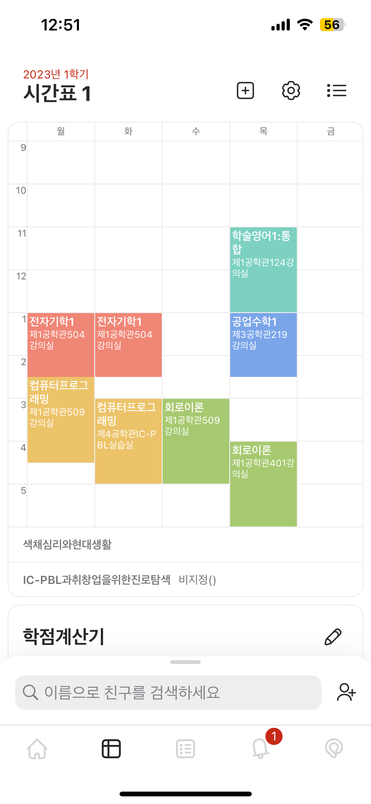
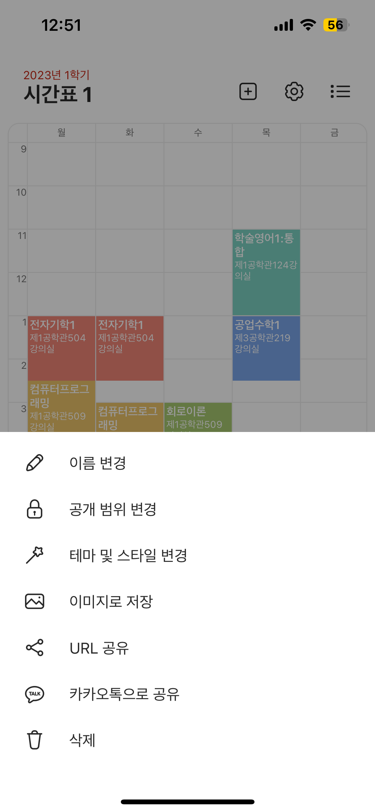
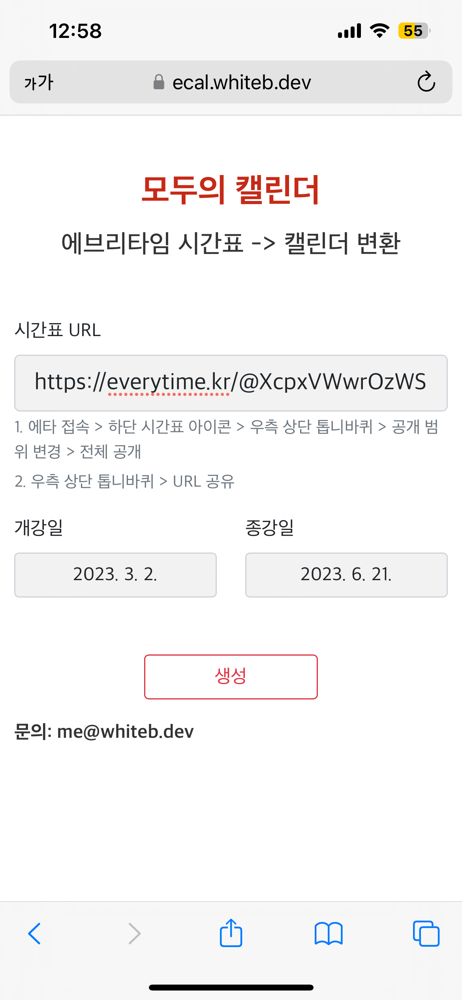
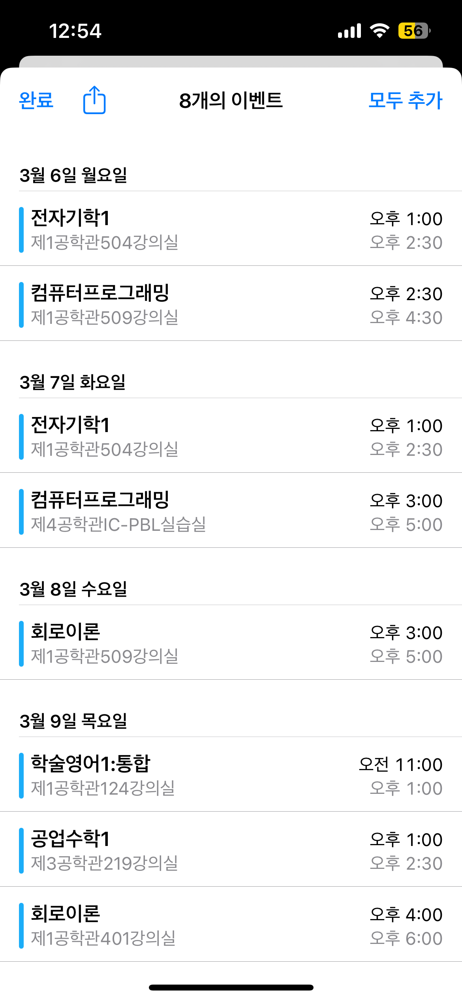

## 모두의 캘린더 (Convert everytime calendar to ical)
> 에브리 타임 시간표를 ical 형식으로 변환합니다.

### 0. 테스트 환경
- 애플 캘린더 형식(ics)를 지원하는 앱(애플 캘린더, 구글 캘린더 등)에서만 일정 등록이 가능합니다.

- Mobile: Safari(iOS) (**추천**), Chrome(Android)
    - 현재 모종의 이유로 iOS환경에서는 Safari만 다운로드 가능합니다.
- PC: Chrome(Windows/Mac), Safari(Mac)

### 사용 방법
|1. 에브리타임에 접속해 변환하려는 캘린더로 접근합니다.|2. 오른쪽 위 톱니바퀴를 눌러 URL 공유를 누릅니다.|
|------|---|
|

|

|
|3. [웹앱](https://ecal.whiteb.dev)에 접속해 시간표 URL 및 개강/종강일을 입력 후 생성 버튼을 클릭합니다.|4. Safari의 경우 우상단 모두 추가를 터치해 캘린더에 추가합니다.|
|

|

|
